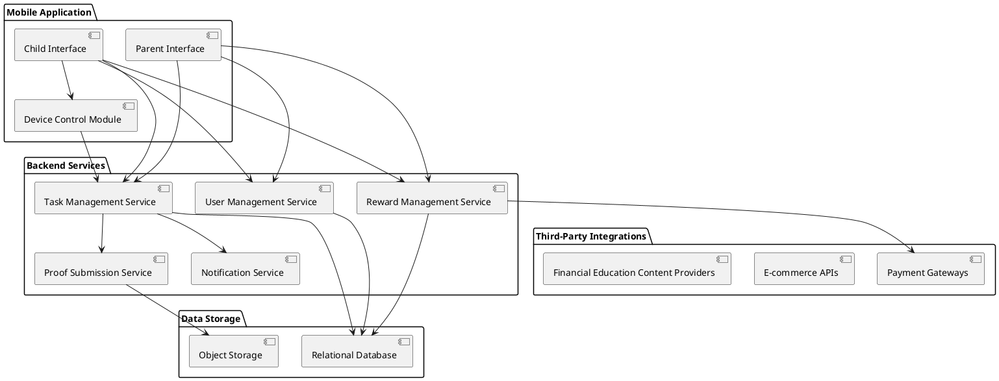

# family device management system

chore-allowance system

## Background Understanding

Target Platform: Target platform is primarly mobile devices like phones, watches, tablets.  
Authentication:  Accounts can only be established by adults.  Separate logins are required for parents and children.  Users are assigned roles.  

SPEC-1: Chore and Reward Management System for Families
:sectnums:
:toc:

== Background

The Chore and Reward Management System is designed to facilitate household task management and financial education for children. This mobile-centric platform allows parents to assign various tasks, such as household chores, learning activities, and physical exercises, to their children. Upon completion of these tasks, children earn rewards in digital forms such as PayPal deposits, gaming credits, gift certificates, shopping credits, or investments. The platform also provides a wish list feature where children can add items from e-commerce sites, and parents can assign tasks to earn those specific items. This system aims to teach children financial literacy by exposing them to different financial products and goals. The platform targets mobile devices, including phones, tablets, and smartwatches, offering a user-friendly experience tailored for both parents and children with separate login capabilities.

== Requirements

*Must Have:*

- The system should support mobile devices, including phones, tablets, and smartwatches.
- Separate user authentication and login processes for parents and children, with different sets of user activities for each.
- Parents should be able to assign various tasks to children, including household chores, learning activities, and physical exercises.
- Children should earn rewards in various digital forms (e.g., PayPal, gaming credits, gift certificates, shopping credits, and investment accounts).
- A wish list feature where children can add items from e-commerce sites.
- A functionality allowing parents to assign equivalent tasks to earn the items listed in the wish list.
- A cap on monthly spending or rewards set by parents.

*Should Have:*

- Multi-factor authentication for added security.
- Notifications and reminders for tasks and deadlines for children.
- Progress tracking for both tasks and financial goals.

*Could Have:*

- Integration with popular e-commerce sites to facilitate the wish list feature.
- Educational content on financial literacy and goal setting.
- A leaderboard or gamification elements to motivate children.

*Won't Have:*

- Desktop or web platform support initially, focusing solely on mobile platforms.
- Integration with non-digital rewards or physical reward distribution.

### Step 2: Method - Architecture Design

Based on the requirements, the architecture will consist of the following key components:

1. **Mobile Application (Frontend)**:
   - **Parent Interface**: Allows parents to manage tasks, set financial goals, assign rewards, and monitor progress.
   - **Child Interface**: Allows children to view assigned tasks, submit proofs, track earned rewards, and explore financial education content.
   - **Device Control Module**: Restricts device usage based on task completion.

2. **Backend Services**:
   - **User Management Service**: Handles authentication, user roles (parent/child), and profile management.
   - **Task Management Service**: Manages the creation, assignment, and tracking of tasks.
   - **Reward Management Service**: Manages the digital rewards, transactions, and integration with financial platforms (e.g., PayPal, gaming credits, etc.).
   - **Proof Submission Service**: Handles the upload and verification of task proofs (images, documents, test results).
   - **Notification Service**: Sends notifications and reminders to users.

3. **Data Storage**:
   - **Relational Database**: Stores user profiles, tasks, rewards, and activity logs.
   - **Object Storage**: Stores proof submissions (images, documents).

4. **Third-Party Integrations**:
   - **Payment Gateways**: For processing financial transactions (e.g., PayPal).
   - **E-commerce APIs**: For wish list integration.
   - **Financial Education Content Providers**: For educational modules and resources.

5. **Security and Compliance**:
   - **Data Encryption**: For secure storage and transmission of sensitive data.
   - **Access Control**: Role-based access control to separate parent and child functionalities.
   - **Compliance Modules**: Ensure adherence to COPPA, GDPR, and other relevant regulations.


#### High-Level Component Diagram (PlantUML)

A high-level component diagram to visualize the architecture:



### Step 3: Method - Detailed Architecture with Educational Focus
Integrate a strong educational focus and add advanced features like curiosity exploration, distress detection, and mindfulness practices. Expand  architecture to include additional components and services and align with  technology choices: **Java Spring Boot backend** and  **React frontend**. Integrate school apps and use data tools to enhance educational experience.

#### Updated Architecture Components

1. **Frontend (React) Enhancements**:
   - **Parent Interface**: Enhanced to include tools for setting educational goals and monitoring progress, integration with school apps.
   - **Child Interface**: Includes sections for educational content, curiosity exploration (powered by ChatGPT), task completion, and mindfulness practices.
   - **Educational Integration Module**: Facilitates seamless integration with apps and platforms used by the child's school (e.g., Google Classroom, Microsoft Teams).

2. **Backend Services (Java Spring Boot)**:
   - **User Management Service**: Extended to support integration with school-based Single Sign-On (SSO) systems.
   - **Task Management Service**: Enhanced to include educational tasks and goal-setting capabilities.
   - **Reward Management Service**: Manages educational rewards, such as book vouchers or online course credits.
   - **Proof Submission Service**: Supports submission of school assignments or proofs of learning, integrated with school platforms.
   - **Notification Service**: Sends notifications for task deadlines, educational content, and mindfulness prompts.
   - **Educational Content Service**: Delivers personalized educational content based on the child's progress and areas of curiosity.
   - **Curiosity Exploration Service (ChatGPT Integration)**: Provides a safe, monitored environment where children can explore topics of interest.
   - **Distress Detection Service**: Uses natural language processing (NLP) and machine learning to detect upsetting or distressing content in communications and browsing history.
   - **Mindfulness and Wellbeing Service**: Offers guided mindfulness exercises, relaxation techniques, and wellbeing practices tailored for children.

3. **Data Storage and Analytics**:
   - **Relational Database (PostgreSQL)**: Stores user data, tasks, educational content, rewards, and interaction logs.
   - **Data Warehouse (Snowflake or Google BigQuery)**: Aggregates data from various sources to provide insights into user behavior, educational progress, and areas needing improvement.
   - **Data Analysis and Reporting Tools**: Tools like Apache Superset or Tableau to visualize data trends and generate reports on educational progress and behavioral insights.
   - **Machine Learning Models**: Used for predicting areas of need and personalizing educational content and interventions.

4. **Third-Party Integrations**:
   - **School Apps Integration (Google Classroom, Microsoft Teams, etc.)**: Allows children to manage school assignments alongside home tasks and rewards.
   - **ChatGPT API**: For curiosity-driven exploration and learning.
   - **Distress Content Detection API**: Integrates with services like Bark or Qustodio for monitoring and flagging inappropriate or distressing content.
   - **Mindfulness Content Providers**: Integrates with apps like Headspace for Kids or Calm to deliver mindfulness exercises.

5. **Security and Compliance**:
   - **Data Encryption and Privacy Controls**: Ensure all sensitive data is encrypted in transit and at rest.
   - **Parental Controls and Monitoring**: Allow parents to monitor interactions and set boundaries for ChatGPT and other exploratory tools.
   - **Compliance Modules**: Ensure adherence to COPPA, GDPR, and other relevant regulations regarding children's data and online safety.

#### Enhanced Component Diagram (PlantUML)

Below is an enhanced PlantUML diagram representing the updated architecture with the educational focus:

```plantuml
@startuml

package "Frontend (React)" {
  [Parent Interface]
  [Child Interface]
  [Educational Integration Module]
}

package "Backend Services (Java Spring Boot)" {
  [User Management Service]
  [Task Management Service]
  [Reward Management Service]
  [Proof Submission Service]
  [Notification Service]
  [Educational Content Service]
  [Curiosity Exploration Service]
  [Distress Detection Service]
  [Mindfulness and Wellbeing Service]
}

package "Data Storage and Analytics" {
  [Relational Database (PostgreSQL)]
  [Data Warehouse (Snowflake/Google BigQuery)]
  [Data Analysis and Reporting Tools]
  [Machine Learning Models]
}

package "Third-Party Integrations" {
  [School Apps Integration (Google Classroom, Microsoft Teams)]
  [ChatGPT API]
  [Distress Content Detection API]
  [Mindfulness Content Providers]
}

[Parent Interface] --> [User Management Service]
[Child Interface] --> [User Management Service]
[Parent Interface] --> [Task Management Service]
[Child Interface] --> [Task Management Service]
[Child Interface] --> [Educational Integration Module]
[Educational Integration Module] --> [School Apps Integration (Google Classroom, Microsoft Teams)]
[Child Interface] --> [Curiosity Exploration Service]
[Curiosity Exploration Service] --> [ChatGPT API]
[Child Interface] --> [Distress Detection Service]
[Distress Detection Service] --> [Distress Content Detection API]
[Child Interface] --> [Mindfulness and Wellbeing Service]
[Mindfulness and Wellbeing Service] --> [Mindfulness Content Providers]
[Task Management Service] --> [Notification Service]
[Task Management Service] --> [Proof Submission Service]
[Proof Submission Service] --> [Relational Database (PostgreSQL)]
[Reward Management Service] --> [Relational Database (PostgreSQL)]
[Reward Management Service] --> [Educational Content Service]
[Educational Content Service] --> [Data Warehouse (Snowflake/Google BigQuery)]
[User Management Service] --> [Relational Database (PostgreSQL)]
[Data Analysis and Reporting Tools] --> [Data Warehouse (Snowflake/Google BigQuery)]
[Machine Learning Models] --> [Data Warehouse (Snowflake/Google BigQuery)]

@enduml
```



#### Data Tools and Features

1. **Data Analysis for Improvement and Curiosity**:
   - **User Behavior Analysis**: Utilize data tools like Apache Superset or Tableau to track user engagement with educational content, tasks completed, and areas of curiosity. Generate reports for parents to highlight strengths and areas needing improvement.
   - **Predictive Analytics**: Implement machine learning models to predict areas where a child might struggle or excel based on past performance. Use these predictions to tailor educational content and recommend additional resources.
   - **Content Recommendation Engine**: Use machine learning to recommend content based on detected areas of interest or gaps in knowledge, encouraging exploration and learning.

2. **Monitoring for Distress and Safety**:
   - **NLP and Sentiment Analysis**: Use NLP techniques to analyze communication patterns and detect negative sentiment or distress signals in online communications and browsing behavior.
   - **Integration with Safety Tools**: Utilize APIs from child safety tools (e.g., Bark, Qustodio) to monitor and flag inappropriate or harmful content, providing alerts to parents.

3. **Mindfulness and Wellbeing**:
   - **Mindfulness Module**: Incorporate fun, interactive mindfulness practices and relaxation exercises into the child interface. Offer daily or weekly mindfulness challenges to help children build emotional resilience and focus.


### Step 4: Method - Data Model Design

#### Key Entities and Their Relationships

Based on requirements,  the following key entities for a relational database (PostgreSQL) are defined. The data model consists of tables to store information about users, tasks, rewards, educational content, proofs of completion, interactions with ChatGPT, distress signals, and mindfulness practices.

Here is a brief overview of the key entities:

1. **User**: Stores information about users (both parents and children), including their roles, authentication details, and profile information.
2. **Task**: Represents tasks assigned to children, including details such as type, description, reward points, due date, and status.
3. **Reward**: Manages the various types of rewards (digital currency, gift cards, educational rewards) and links them to completed tasks.
4. **Proof**: Stores proof of task completion, such as uploaded images, documents, or test results.
5. **EducationalContent**: Contains information about educational modules or content provided to children, including links, descriptions, and topics.
6. **InteractionLog**: Logs interactions with the ChatGPT service for curiosity exploration, including the content of interactions and timestamps.
7. **DistressSignal**: Captures detected distress signals based on the analysis of user activity or communications, along with severity levels and timestamps.
8. **MindfulnessActivity**: Logs mindfulness activities completed by children, including type, duration, and feedback.

#### Database Schema

Below is a proposed schema for the relational database:

```plaintext
-- User Table
CREATE TABLE User (
    user_id SERIAL PRIMARY KEY,
    username VARCHAR(50) UNIQUE NOT NULL,
    password_hash VARCHAR(255) NOT NULL,
    role ENUM('PARENT', 'CHILD') NOT NULL,
    first_name VARCHAR(50),
    last_name VARCHAR(50),
    email VARCHAR(100),
    phone_number VARCHAR(15),
    date_of_birth DATE,
    created_at TIMESTAMP DEFAULT CURRENT_TIMESTAMP,
    updated_at TIMESTAMP DEFAULT CURRENT_TIMESTAMP
);

-- Task Table
CREATE TABLE Task (
    task_id SERIAL PRIMARY KEY,
    user_id INT REFERENCES User(user_id),
    task_type ENUM('CHORE', 'EDUCATIONAL', 'PHYSICAL', 'OTHER') NOT NULL,
    description TEXT NOT NULL,
    reward_points INT NOT NULL,
    due_date TIMESTAMP,
    status ENUM('PENDING', 'COMPLETED', 'OVERDUE') DEFAULT 'PENDING',
    created_at TIMESTAMP DEFAULT CURRENT_TIMESTAMP,
    updated_at TIMESTAMP DEFAULT CURRENT_TIMESTAMP
);

-- Reward Table
CREATE TABLE Reward (
    reward_id SERIAL PRIMARY KEY,
    user_id INT REFERENCES User(user_id),
    reward_type ENUM('PAYPAL', 'GIFT_CARD', 'GAMING_CREDIT', 'INVESTMENT', 'EDUCATIONAL') NOT NULL,
    amount DECIMAL(10, 2),
    task_id INT REFERENCES Task(task_id),
    status ENUM('PENDING', 'ISSUED', 'CLAIMED') DEFAULT 'PENDING',
    issued_at TIMESTAMP,
    claimed_at TIMESTAMP,
    created_at TIMESTAMP DEFAULT CURRENT_TIMESTAMP
);

-- Proof Table
CREATE TABLE Proof (
    proof_id SERIAL PRIMARY KEY,
    task_id INT REFERENCES Task(task_id),
    proof_type ENUM('IMAGE', 'DOCUMENT', 'TEST_RESULT') NOT NULL,
    proof_url TEXT NOT NULL,
    submitted_at TIMESTAMP DEFAULT CURRENT_TIMESTAMP,
    verified BOOLEAN DEFAULT FALSE,
    verified_at TIMESTAMP
);

-- EducationalContent Table
CREATE TABLE EducationalContent (
    content_id SERIAL PRIMARY KEY,
    topic VARCHAR(100) NOT NULL,
    description TEXT,
    content_url TEXT NOT NULL,
    content_type ENUM('ARTICLE', 'VIDEO', 'QUIZ', 'INTERACTIVE') NOT NULL,
    created_at TIMESTAMP DEFAULT CURRENT_TIMESTAMP,
    updated_at TIMESTAMP DEFAULT CURRENT_TIMESTAMP
);

-- InteractionLog Table
CREATE TABLE InteractionLog (
    interaction_id SERIAL PRIMARY KEY,
    user_id INT REFERENCES User(user_id),
    interaction_text TEXT NOT NULL,
    response_text TEXT NOT NULL,
    timestamp TIMESTAMP DEFAULT CURRENT_TIMESTAMP
);

-- DistressSignal Table
CREATE TABLE DistressSignal (
    signal_id SERIAL PRIMARY KEY,
    user_id INT REFERENCES User(user_id),
    detected_content TEXT NOT NULL,
    severity ENUM('LOW', 'MEDIUM', 'HIGH') NOT NULL,
    detected_at TIMESTAMP DEFAULT CURRENT_TIMESTAMP,
    resolved BOOLEAN DEFAULT FALSE,
    resolved_at TIMESTAMP
);

-- MindfulnessActivity Table
CREATE TABLE MindfulnessActivity (
    activity_id SERIAL PRIMARY KEY,
    user_id INT REFERENCES User(user_id),
    activity_type ENUM('BREATHING', 'MEDITATION', 'YOGA', 'OTHER') NOT NULL,
    duration INT, -- Duration in minutes
    feedback TEXT,
    completed_at TIMESTAMP DEFAULT CURRENT_TIMESTAMP
);
```

#### Data Tools and Features

1. **Data Aggregation and Analysis**:
   - **Data Warehouse Integration**: Data from these tables can be regularly synced with a data warehouse like Snowflake or Google BigQuery. This will allow for complex analytics and machine learning tasks, such as understanding user engagement patterns, predicting educational needs, and generating personalized content.
   - **Data Visualization**: Tools like Apache Superset or Tableau can be used to create dashboards for parents and administrators, displaying metrics such as task completion rates, reward distributions, educational progress, and distress signals detected.

2. **Machine Learning and AI Integration**:
   - **Behavioral Insights**: Use machine learning models to analyze data from the `InteractionLog`, `DistressSignal`, and `Task` tables to identify patterns that may indicate areas of interest or concern. 
   - **Personalized Content Recommendation**: Leverage data from the `EducationalContent` and `InteractionLog` tables to recommend personalized content to children, fostering a deeper engagement with topics they show curiosity about.
   - **Distress Detection and Response**: Utilize NLP and sentiment analysis models to continuously analyze interactions and detect potential distress, enabling prompt intervention and support.

3. **Monitoring and Alerts**:
   - **Automated Alerts**: Based on data from the `DistressSignal` table, automated alerts can be sent to parents or guardians when a high-severity signal is detected, along with suggested actions or resources.
   - **Performance Feedback**: Provide regular feedback to children based on their activity data in the `MindfulnessActivity`, `Task`, and `EducationalContent` tables, helping them understand their progress and areas for improvement.


### Step 5: Method - API Design

#### API Overview

The API design will focus on RESTful principles, allowing seamless communication between the frontend (React) and backend services (Java Spring Boot). We'll define the endpoints for the following key functionalities:

1. **User Management**: Endpoints for user authentication, registration, profile management, and role-specific actions.
2. **Task Management**: Endpoints for creating, updating, deleting, and retrieving tasks for children.
3. **Reward Management**: Endpoints for managing rewards, including assigning rewards to tasks and issuing rewards upon task completion.
4. **Proof Submission**: Endpoints for submitting proof of task completion, such as uploading images, documents, or test results.
5. **Educational Content**: Endpoints for retrieving educational content, tracking progress, and recommending content.
6. **Curiosity Exploration (ChatGPT Integration)**: Endpoints for interacting with ChatGPT, logging interactions, and filtering content.
7. **Distress Monitoring**: Endpoints for logging distress signals, retrieving distress logs, and notifying parents.
8. **Mindfulness Activities**: Endpoints for retrieving mindfulness exercises, logging activities, and providing feedback.

#### Detailed API Endpoints

Here is a detailed outline of the API endpoints for each service:

##### 1. User Management API

```http
POST /api/v1/users/register
```
- **Description**: Registers a new user (parent or child).
- **Request Body**: JSON with user details (username, password, role, etc.).
- **Response**: JSON with user ID and status.

```http
POST /api/v1/users/login
```
- **Description**: Authenticates a user.
- **Request Body**: JSON with username and password.
- **Response**: JSON with authentication token and user details.

```http
GET /api/v1/users/{userId}
```
- **Description**: Retrieves user profile details.
- **Path Parameter**: `userId` - ID of the user.
- **Response**: JSON with user profile information.

```http
PUT /api/v1/users/{userId}
```
- **Description**: Updates user profile information.
- **Path Parameter**: `userId` - ID of the user.
- **Request Body**: JSON with updated user details.
- **Response**: JSON with updated profile information.

##### 2. Task Management API

```http
POST /api/v1/tasks
```
- **Description**: Creates a new task for a child.
- **Request Body**: JSON with task details (description, reward points, due date, etc.).
- **Response**: JSON with task ID and status.

```http
GET /api/v1/tasks
```
- **Description**: Retrieves all tasks assigned to a child.
- **Query Parameters**: `userId` - ID of the child.
- **Response**: JSON array with task details.

```http
PUT /api/v1/tasks/{taskId}
```
- **Description**: Updates a specific task.
- **Path Parameter**: `taskId` - ID of the task.
- **Request Body**: JSON with updated task details.
- **Response**: JSON with updated task information.

```http
DELETE /api/v1/tasks/{taskId}
```
- **Description**: Deletes a specific task.
- **Path Parameter**: `taskId` - ID of the task.
- **Response**: JSON with deletion status.

##### 3. Reward Management API

```http
POST /api/v1/rewards
```
- **Description**: Assigns a reward to a completed task.
- **Request Body**: JSON with reward details (type, amount, task ID, etc.).
- **Response**: JSON with reward ID and status.

```http
GET /api/v1/rewards
```
- **Description**: Retrieves all rewards for a child.
- **Query Parameters**: `userId` - ID of the child.
- **Response**: JSON array with reward details.

```http
PUT /api/v1/rewards/{rewardId}
```
- **Description**: Updates a specific reward.
- **Path Parameter**: `rewardId` - ID of the reward.
- **Request Body**: JSON with updated reward details.
- **Response**: JSON with updated reward information.

##### 4. Proof Submission API

```http
POST /api/v1/proofs
```
- **Description**: Submits proof for a completed task.
- **Request Body**: JSON with proof details (proof type, URL, task ID, etc.).
- **Response**: JSON with proof ID and status.

```http
GET /api/v1/proofs
```
- **Description**: Retrieves all proofs submitted by a child.
- **Query Parameters**: `userId` - ID of the child.
- **Response**: JSON array with proof details.

##### 5. Educational Content API

```http
GET /api/v1/educational-content
```
- **Description**: Retrieves educational content based on child's interests and progress.
- **Query Parameters**: `userId` - ID of the child.
- **Response**: JSON array with educational content details.

```http
POST /api/v1/educational-content/progress
```
- **Description**: Logs progress on an educational module.
- **Request Body**: JSON with progress details (content ID, progress percentage, etc.).
- **Response**: JSON with status.

##### 6. Curiosity Exploration API (ChatGPT Integration)

```http
POST /api/v1/chatgpt/interact
```
- **Description**: Sends a query to ChatGPT for curiosity exploration.
- **Request Body**: JSON with query text and user ID.
- **Response**: JSON with response text from ChatGPT.

```http
GET /api/v1/chatgpt/interactions
```
- **Description**: Retrieves all ChatGPT interactions for a child.
- **Query Parameters**: `userId` - ID of the child.
- **Response**: JSON array with interaction logs.

##### 7. Distress Monitoring API

```http
POST /api/v1/distress-signals
```
- **Description**: Logs a detected distress signal.
- **Request Body**: JSON with distress details (content, severity, etc.).
- **Response**: JSON with distress signal ID and status.

```http
GET /api/v1/distress-signals
```
- **Description**: Retrieves all distress signals for a child.
- **Query Parameters**: `userId` - ID of the child.
- **Response**: JSON array with distress signal details.

##### 8. Mindfulness Activities API

```http
GET /api/v1/mindfulness-activities
```
- **Description**: Retrieves available mindfulness activities.
- **Response**: JSON array with mindfulness activity details.

```http
POST /api/v1/mindfulness-activities/log
```
- **Description**: Logs a completed mindfulness activity.
- **Request Body**: JSON with activity details (type, duration, feedback, etc.).
- **Response**: JSON with activity log ID and status.
  
#### Security and Authentication

- **JWT Authentication**: All API endpoints will require JWT-based authentication to ensure secure communication between the frontend and backend.
- **Role-Based Access Control (RBAC)**: Endpoints will enforce role-based access control, allowing only authorized users to perform specific actions (e.g., parents assigning tasks, children completing tasks).
